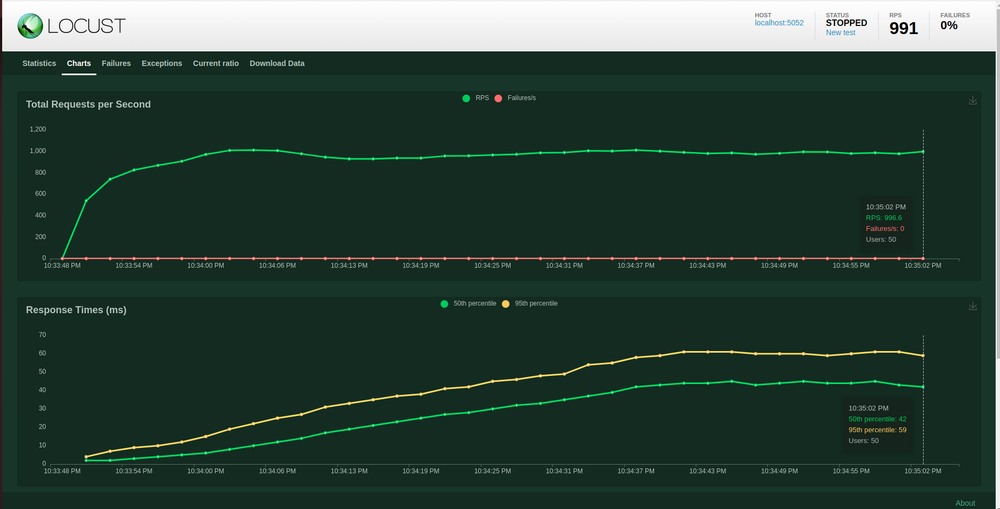
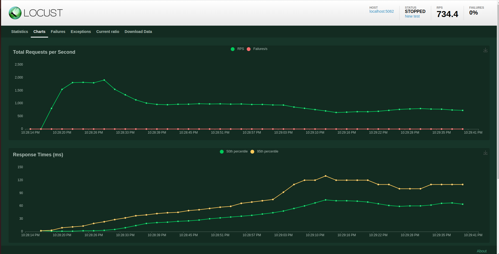
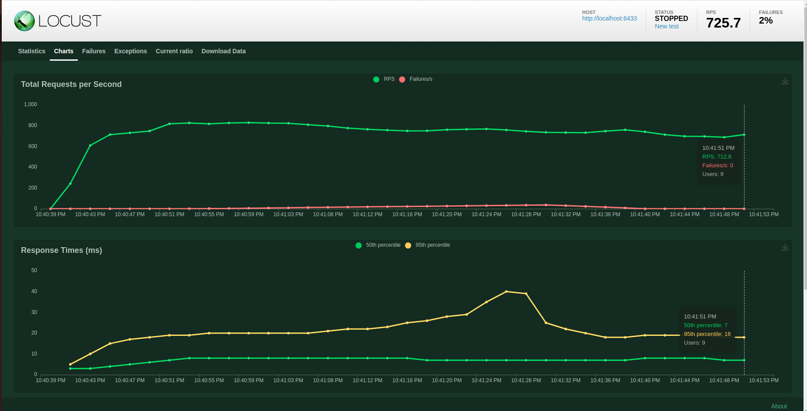

# load test habib web service

first you need create python virtual envirment

then install pip packages

```shell
pip install -r requierments.txt
```

then run locust and use ui to run test

```shell
locust [userClass]
```

and user class is one of these:
    
* AuthUser 
* BizUser 
* GatewayUser


we can compile proto files with this command

```shell
python -m grpc_tools.protoc -I. --python_out=. --pyi_out=. --grpc_python_out=. protos/*.proto --experimental_allow_proto3_optional
```

### results

I ran load tests with 50 users and get these results.

1. auth server:

2. biz server:

3. gateway server:
